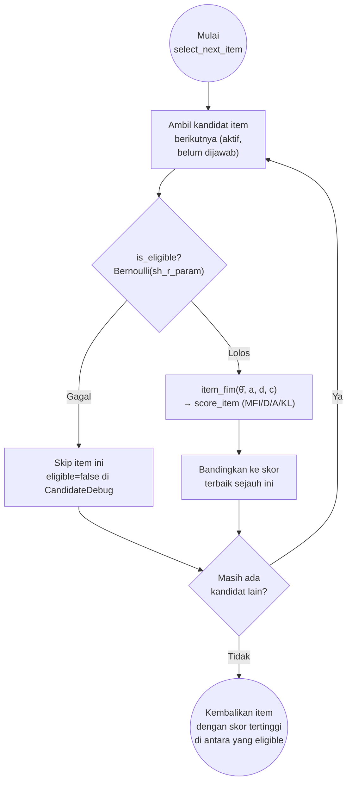

# Exposure Control pada MCAT — Catatan

> File ini adalah catatan riset (bukan dokumentasi API). Implementasi resmi ada di
> [`src/mcat/exposure/`](../../mcat/exposure), dipanggil dari
> [`McatEngine::select_next_item`](../../mcat/engine.rs). Kontrak client-facing ada di
> [`API_CONTEXT.md`](../../../API_CONTEXT.md) (bagian `TestSettings`: `exposure_method`;
> bagian item: `sh_r_param`).
>
> **Catatan (2026-08-13):** Method `MaxPriorityIndex`/`max_priority_index` (dulu §2.3 di
> sini) sudah dihapus dari codebase — soft-penalty berbasis `mpi_w1`/`mpi_w2` dianggap
> tidak cukup terverifikasi terhadap rumus asli Cheng & Chang (2009) untuk dipakai
> produksi. `ExposureMethod` sekarang cuma `None` dan `SympsonHetter`. §5 poin 4 di
> bawah masih membahas MPI sebagai arah eksperimental kalau method ini mau dibangun
> ulang dari nol, dengan port rumus asli yang lebih setia.

## 1. Apa itu exposure control dalam CAT

Item selection berbasis informasi (MFI/D-optimal/A-optimal/KL — lihat
[`experimental/item_selection`](../item_selection)) punya efek samping: item dengan
diskriminasi tinggi (`a` besar) akan selalu menang di banyak sesi berturut-turut kalau
tidak dikendalikan, sehingga (a) item itu jadi bocor/dihafal peserta (ancaman keamanan
tes) dan (b) sisa item bank jarang terpakai (pemborosan investasi pembuatan item).
**Exposure control** adalah komponen ke-3 dari algoritma item selection CAT — setelah
content balancing dan item selection criterion — yang menyisipkan faktor acak/penalti
supaya distribusi pemakaian item lebih merata (Han, 2018 [1], Fig. 2, "3 components of
a conventional CAT item selection algorithm"). Catatan `kl_information_notes.md` di
folder sebelah memakai sumber yang sama untuk kerangka 3-komponen ini.

Perlu dicatat, exposure control **tidak selalu perlu**: Han (2018 [1]) secara eksplisit
menyebut kuesioner diagnostik medis, pengukuran kepribadian, dan adaptive learning tools
sebagai konteks di mana exposure control boleh dilewati — relevan untuk kenapa
`ExposureMethod::None` ada sebagai opsi resmi di project ini, bukan sekadar nilai
default kosong.

## 2. Method yang diimplementasikan

`ExposureMethod` ([`mod.rs:9-12`](../../mcat/exposure/mod.rs)) punya 2 varian:
`None`, `SympsonHetter`. Dispatch-nya di
[`is_eligible()`](../../mcat/exposure/mod.rs):

```rust
pub fn is_eligible(method: &ExposureMethod, sh_r_param: f64) -> bool {
    match method {
        ExposureMethod::None => true,
        ExposureMethod::SympsonHetter => sympson_hetter::is_eligible(sh_r_param),
    }
}
```

Poin penting yang langsung terlihat dari dispatcher ini: **hanya `SympsonHetter` yang
benar-benar melakukan *hard gate* (blokir item)**. `None` selalu mengembalikan `true` —
benar-benar tanpa kontrol eksposur sama sekali.

### 2.1 `none`

Tidak ada logika tambahan — item selection murni mengikuti `selection_method`
(MFI/D-optimal/A-optimal/KL) tanpa penalti atau blokir apa pun. Cocok untuk piloting/
kalibrasi item baru (butuh setiap item dipakai sesering mungkin, bukan dibatasi) atau
konteks non-high-stakes yang disebut Han (2018 [1]) di atas.

### 2.2 `sympson_hetter` ([`sympson_hetter.rs`](../../mcat/exposure/sympson_hetter.rs))

#### Teori klasik

Sympson & Hetter (1985) memisahkan `P(S)` — peluang item **terpilih** oleh kriteria
seleksi (mis. item paling informatif) — dari `P(A)` — peluang item **benar-benar
diadministrasikan**. Deskripsi paling lengkap yang bisa diverifikasi dari sumber
open-access (Han, 2018 [1], seksi "Sympson-Hetter method", quote verbatim):

> "In the probabilistic approach developed by Sympson and Hetter [1985], the
> probability P(A) that an item will be administered is differentiated from the
> probability P(S) that the item will be selected based on the item selection
> criterion. ... the Sympson-Hetter (SH) method introduces the conditional
> probability P(A|S) that the selected item will actually be administered. In order
> to keep the P(A) at a desirable target level, the P(A|S) that results in the target
> P(A) is derived from iterative simulations. ... During CAT administration, all
> eligible items are ordered by the choice of item selection criterion. Starting from
> the best item, the item exposure parameter is compared against a randomly generated
> value between 0 and 1 ... If the random value is smaller than the exposure
> parameter, [the item is administered]."

Dua hal yang wajib digarisbawahi dari kutipan ini:

1. **`P(A|S)` (disebut juga `K_i` atau `w_i` di literatur turunannya) dikalibrasi lewat
   *iterative simulation offline*** — bukan dihitung langsung dari rumus tertutup saat
   CAT berjalan. Nilainya per-item, tetap untuk satu periode penggunaan item pool, dan
   harus dihitung ulang kalau item pool berubah (Han, 2018 [1]).
2. Kalau item terbaik gagal lolos gate, algoritma **lanjut ke item terbaik berikutnya**
   (bukan berhenti tanpa memilih apa pun) — implikasi dari "Starting from the best
   item... [compare]... If [pass], administer" yang tersirat berulang untuk seluruh
   daftar item terurut.

Varian modern (Sharpnack et al., 2026 [2], arXiv, disebut *stochastic Sympson-Hetter*)
menggantikan pembanding acak biner dengan sampling proporsional bertemperatur, tapi
tetap memakai bobot per-item `w_j ∈ (0,1]` yang persis konsep `P(A|S)`/`K_i` di atas:

```
p_{t,j} ∝ w_j · r_{t,j}^β                                    (Eq. 5, [2])
```

di mana `r_{t,j}` adalah rasio informasi relatif item `j`, `β` inverse-temperature
global, dan **"if Sympson-Hetter weights are all set to 1, setting β = 0 gives all
items equal chance..."** — pola "`w=1` berarti tidak ada restriksi tambahan" ini persis
konvensi yang dipakai project ini untuk `sh_r_param` (lihat di bawah).

#### Implementasi di project ini

```rust
/// Accept item with probability `sh_r_param` (K_i / P(A|S)), used langsung — sama
/// seperti mirtCAT (`findNextCATItem.R`, exposure_type == "SH":
/// `design@exposure[item] >= runif(1,0,1)`).
pub fn is_eligible(sh_r_param: f64) -> bool {
    rand::thread_rng().gen_bool(sh_r_param.clamp(0.0, 1.0))
}
```
([`sympson_hetter.rs`](../../mcat/exposure/sympson_hetter.rs))

`sh_r_param` (=`K_i`) dipakai **langsung** sebagai parameter Bernoulli, tanpa
dikombinasikan dengan apa pun lain — persis definisi klasik. Diverifikasi terhadap
implementasi referensi `mirtCAT` (Chalmers) — source aslinya di
[`findNextCATItem.R`](https://github.com/philchalmers/mirtCAT/blob/main/R/findNextCATItem.R):

```r
} else if(design@exposure_type == 'SH'){
    while(TRUE){
        item <- index[which.max(crit)][1L]
        comp <- runif(1, 0, 1)
        if(design@exposure[item] >= comp && person$valid_item[item]) break
        if(length(crit) == 1L) break
        person$valid_item[item] <- FALSE
        pick <- index != item
        index <- index[pick]
        crit <- crit[pick]
    }
}
```

`design@exposure[item]` di `mirtCAT` = `sh_r_param` di project ini: nilai statis per
item, disuplai langsung (bukan dihitung ulang dari rasio eksposur saat itu). Loop
`mirtCAT` di atas berjalan sekuensial dari item terbaik ke terburuk dan berhenti di
item pertama yang lolos gate — secara distribusi ini identik dengan pendekatan
`select_next_item` di sini (uji eligibility semua kandidat lebih dulu, lalu argmax
skor di antara yang lolos), karena tiap gate independen terhadap urutan pengujian.

`sh_r_param` settable per item lewat `CreateItemRequest`/`UpdateItemRequest`
([`item_handler.rs`](../../handlers/item_handler.rs), tervalidasi `[0.0, 1.0]`) dan
kolom opsional di bulk import CSV/XLSX ([`item_import.rs`](../../models/item_import.rs)
— juga muncul di template `.xlsx` yang bisa didownload). FE (`ItemFormPage`,
`ItemsTable`) menampilkan dan mengedit nilainya per item.

#### Alur seleksi item dengan Sympson-Hetter

Per kandidat item (dipanggil dari `next-item` maupun inline dari `respond`, satu kali
untuk setiap item yang belum diadministrasikan dan `is_active`):



Tiap item diuji eligibility-nya **sendiri-sendiri dan independen** (bukan berhenti di
item pertama yang gagal) — hasil akhirnya tetap sama seperti loop sekuensial `mirtCAT`
di atas karena tiap gate `Bernoulli` independen terhadap item lain dan terhadap urutan
pengujian; argmax di akhir cuma mengambil skor tertinggi dari himpunan yang lolos, siapa
pun urutan pengujiannya. Implementasi persis di [`engine.rs`](../../mcat/engine.rs)
diringkas juga di §3 di bawah.

#### Sumber data `exposure_rate`

`exposure_rate` (dipakai untuk audit di `CandidateDebug`, bukan input gate — lihat di
atas) hidup di tabel terpisah `trans_item_exposure_stats` (1:1 dengan `master_items`
via FK, lihat §4), dihitung `exposure_count / master_item_banks.completed_sessions_count`
— `completed_sessions_count` adalah counter per bank yang bertambah `+1` tiap kali
sebuah sesi di bank itu selesai. Upsert `trans_item_exposure_stats` dan bump counter ini
berjalan dalam transaction yang sama dengan update `trans_session_items`/
`trans_test_sessions` lainnya di `submit_response`
([`session_handler.rs`](../../handlers/session_handler.rs)).

## 3. Integrasi di `McatEngine::select_next_item`

Alur lengkap per kandidat item ([`engine.rs:52-111`](../../mcat/engine.rs#L52-L111)),
untuk setiap item yang belum diadministrasikan dan `is_active`:

```
1. eligible = exposure::is_eligible(method, item.sh_r_param)
   → false hanya mungkin terjadi kalau method == SympsonHetter
   → kalau false: item dicatat di CandidateDebug (eligible=false), lalu di-skip
     (continue) — TIDAK ikut kompetisi argmax. Ini yang mewujudkan perilaku
     "lanjut ke item terbaik berikutnya" dari deskripsi Han (2018 [1]) di §2.2.
     (item.exposure_rate ikut dicatat di CandidateDebug untuk audit, tapi bukan
     input gate — gate hanya baca item.sh_r_param, lihat §2.2.)

2. raw_score = selection::score_item(...)   ← MFI / D-optimal / A-optimal / KL
   score = raw_score                        ← None dan SympsonHetter tidak mengubah skor

3. best = argmax score di antara semua kandidat eligible
```

Baik alasan blokir (`eligible=false`) maupun `raw_score` tiap kandidat dicatat di
`CandidateDebug`/`SelectionDebug` ([`debug.rs`](../../mcat/debug.rs)) — berguna untuk
audit kenapa item tertentu tidak terpilih, termasuk memverifikasi apakah gate
`sympson_hetter` sedang benar-benar membatasi (bergantung pada `sh_r_param` item itu,
lihat §2.2).

## 4. Permukaan data & konfigurasi

```
Tabel/Model            Kolom                    Default                 Sumber
──────────────────────────────────────────────────────────────────────────────────
master_items            sh_r_param               1.0 ("always eligible") migrations/002:29
trans_item_exposure_stats     exposure_count           0                       migrations/003:6
  (1:1 FK → master_items, exposure_rate          0.0                     migrations/003:7
   tabel terpisah — §2.2 "Sumber data exposure_rate")
master_item_banks              completed_sessions_count 0                       migrations/001
  (internal, tidak diekspos API — hanya denominator exposure_rate)
master_test_settings           exposure_method          "sympson_hetter"        settings_handler.rs:47
```

`BankExhaustedAction` (`Error | ForceStop | Extend`,
[`mod.rs:31-47`](../../mcat/exposure/mod.rs)) hidup di file yang sama tapi merupakan
kekhawatiran yang berbeda: ia menjawab "item pool habis sebelum stopping rule
psikometrik terpenuhi karena terlalu banyak item diblokir exposure control", bukan
exposure control itu sendiri — analog dengan pembedaan `stopping/` vs alasan berhenti
operasional lain yang dibahas di
[`experimental/stoping/stoping.md §3`](../stoping/stoping.md).

**Toggle on/off untuk preset yang sudah ada.** Awalnya `exposure_method` cuma bisa
diisi saat `POST /settings` (create) — tidak ada jalur resmi untuk mengubahnya pada
preset yang sudah dipakai, kecuali lewat DB langsung. Sudah ditambahkan
`PATCH /settings/:id/exposure` ([`settings_handler.rs::update_exposure_method`](../../handlers/settings_handler.rs),
route di [`routes/settings.rs`](../../routes/settings.rs)) — pola yang sama seperti
`PATCH /settings/:id/debug` untuk `debug_enabled`. Body `{ exposure_method: string }`
divalidasi lewat `ExposureMethod::from_str` yang sama dipakai `McatEngine`
([`engine.rs:36-41`](../../mcat/engine.rs#L36-L41)), jadi nilai tidak valid ditolak
`400` di endpoint, bukan gagal senyap saat engine jalan. "Off" = set ke `"none"`; "on"
= set ke `"sympson_hetter"`.

**Update FE:** `SettingsDetailPage` awalnya memakai endpoint ini sebagai toggle
instant-apply berdiri sendiri (Switch langsung memanggil `PATCH .../exposure` saat
diklik, terpisah dari form field lain). Ini kemudian digabung ke satu form edit
("Save changes") yang sama dengan seluruh field preset lain — `exposure_method` (dan
`debug_enabled`) sekarang cuma state lokal di `EditableForm` sampai user klik "Save
changes", yang mengirim semuanya sekaligus lewat `PATCH /settings/:id` (endpoint
umum, lihat `settings_handler.rs::update_settings`). Alasannya: dua mekanisme simpan
terpisah (toggle instant vs form batch) untuk field yang sebenarnya bertetangga bikin
gampang out-of-sync secara UX, tanpa manfaat nyata. `PATCH /settings/:id/exposure`
dan `/debug` di atas **tetap ada** di API — berguna untuk caller lain yang mau PATCH
satu field tanpa fetch+merge seluruh preset — tapi FE sendiri sudah tidak memakainya.

Catatan: endpoint ini hanya mengubah `exposure_method`, bukan `sh_r_param` — itu diatur
per item lewat `CreateItemRequest`/`UpdateItemRequest` (`item_handler.rs`) atau bulk
import, terpisah dari preset. Menyalakan `sympson_hetter` tanpa menurunkan `sh_r_param`
item dari default `1.0` membuat gate itu efektif tidak membatasi apa pun (lihat §2.2)
— itu pilihan operator yang eksplisit, bukan sesuatu yang otomatis dikalibrasi (lihat
§5 poin 1).

## 5. Ide eksperimental (alasan folder ini ada)

1. **Kalibrasi offline `sh_r_param`** — `sh_r_param` sudah settable per item lewat API
   (§2.2), tapi yang *mengisi*-nya dengan nilai yang benar secara otomatis masih belum
   ada. Sympson-Hetter asli mensyaratkan simulasi iteratif untuk menentukan `P(A|S)`
   per item agar `P(A)` konvergen ke target rate yang diinginkan (Han, 2018 [1];
   Sharpnack et al., 2026 [2] §4.3 mendeskripsikan prosedur two-loop modern untuk
   `w_j` dan `β`). Tidak ada kolom `TestSettings` yang menyimpan target rate ini —
   kalau tool kalibrasi dibangun, target rate-nya jadi parameter ke tool itu sendiri,
   dan `sh_r_param` diset manual per item sampai saat itu — folder ini cocok untuk
   mencoba kalibrasi offline berbasis simulasi sesi historis.
2. **Conditional/multinomial method** — SH dan varian di atas mengontrol exposure
   *marginal* (lintas semua peserta), tapi tidak menjamin exposure rate wajar di dalam
   tiap kelompok kemampuan (Han, 2018 [1], seksi "Conditional multinomial method";
   Sharpnack et al., 2026 [2] menyebut metrik "Maximum Conditional Exposure/MCE" untuk
   masalah yang sama). Item bisa saja aman secara marginal tapi bocor di satu kelompok
   θ tertentu.
3. **Randomesque / fade-away** sebagai alternatif ringan (Kingsbury & Zara, 1989, dan
   metode fade-away, keduanya disinggung Han 2018 [1]) — tidak butuh parameter
   terkalibrasi sama sekali, cocok dibandingkan dengan `sympson_hetter` untuk item pool
   kecil.
4. **Maximum Priority Index (MPI), kalau mau dicoba lagi** — sempat diimplementasikan di
   project ini sebagai soft-penalty linear (`w1·info − w2·exposure_rate`) lalu dihapus
   karena bukan port yang setia dari rumus asli Cheng & Chang (2009): rumus asli
   mengalikan (bukan menjumlahkan) banyak constraint sekaligus lewat matriks relevansi
   `c_jk` dan mekanisme quota 2 fase (lihat catatan di §1). Kalau dibangun ulang,
   sebaiknya port rumus `PI_j = I_j × ∏ (w_k f_k)^{c_jk}` ([3], p.4) langsung, bukan
   aproksimasi.

## 6. Referensi

Rumus pada dokumen ini diverifikasi langsung dari isi PDF sumber (diunduh dan dibaca
lewat `pdftotext`, bukan dari abstrak/ringkasan pihak ketiga), kecuali yang secara
eksplisit ditandai "tidak dapat diakses" di bawah.

**[1]** Han, K. T. (2018). Components of the item selection algorithm in computerized
adaptive testing. *Journal of Educational Evaluation for Health Professions*, 15,
Article 7. https://doi.org/10.3352/jeehp.2018.15.7 — Open access (CC-BY). PDF:
https://www.jeehp.org/upload/pdf/jeehp-15-7.pdf (mirror:
https://pmc.ncbi.nlm.nih.gov/articles/PMC5968224/). Sudah dipakai juga di
[`kl_information_notes.md`](../item_selection/kl_information/kl_information_notes.md).
**Seksi "Item exposure control", termasuk sub-seksi "Sympson-Hetter method", "Randomesque",
"Unconditional multinomial method", "Conditional multinomial method", dan "Fade-away
method"**, halaman 6–7 dari 13 (PDF) — dikutip verbatim di §2.1 dan §2.2 di atas.

**[2]** Sharpnack, J., Tsigler, A., Lockwood, J. R., Nydick, S., & von Davier, A. A.
(2026). S2A3: Thompson Sampling and Stochastic Exposure Control for High-Stakes CATs.
arXiv:2606.07364. PDF: https://arxiv.org/pdf/2606.07364 (abstrak:
https://arxiv.org/abs/2606.07364) — preprint (belum peer-reviewed pada saat penelusuran
ini), tapi diunduh dan dibaca langsung; **§4.1 "Selection Probabilities and Temperature
Scaling", Eq. 5**, dikutip verbatim di §2.2. Dipilih sebagai referensi tambahan karena
menunjukkan Sympson-Hetter masih dipakai/dikembangkan di sistem CAT high-stakes
operasional (Duolingo English Test) hingga saat ini, dengan konvensi bobot per-item
`w_j` yang sama seperti `sh_r_param` di project ini.

**[3]** He, W., Diao, Q., & Hauser, C. (2013). *A Comparison of Four Item-Selection
Methods for Severely Constrained CATs*. Paper presented at the 2013 NCME Annual
Meeting. ERIC ED542221. PDF: https://files.eric.ed.gov/fulltext/ED542221.pdf — Open
access (ERIC), diunduh dan dibaca langsung. **Seksi "Maximum Priority Index (MPI)",
halaman 4**, memuat rumus `PI_j = I_j × ∏(w_k f_k)^{c_jk}` yang dikutip verbatim di
§5 poin 4 — bacaan latar belakang untuk MPI (method sudah dihapus dari codebase, lihat
catatan di §1), dipakai sebagai sumber verifikasi karena mereproduksi rumus asli
Cheng & Chang (2009) secara eksplisit untuk keperluan perbandingan metode, bukan dari
ringkasan pihak ketiga.

**[4]** Chalmers, R. P. `mirtCAT` (R package). `findNextCATItem.R`,
`exposure_type == "SH"` branch — diverifikasi langsung dari source code:
https://github.com/philchalmers/mirtCAT/blob/main/R/findNextCATItem.R. Dipakai sebagai
referensi implementasi (bukan makalah) untuk memvalidasi bahwa gate SH di project ini
(§2.2) memakai parameter per-item secara langsung, sama seperti library CAT yang
banyak dipakai di riset/produksi ini.

### Bacaan lanjutan (sumber primer, tapi paywalled di semua tempat yang saya coba akses saat penelusuran ini — dicek via institusi/perpustakaan untuk konfirmasi rumus asli)

- Sympson, J. B., & Hetter, R. D. (1985). *Controlling item-exposure rates in
  computerized adaptive testing*. Proceedings of the 27th Annual Meeting of the
  Military Testing Association, 973–977, San Diego, CA. — **Sumber primer/asli** dari
  metode Sympson-Hetter, dikutip langsung oleh [1] dan [2]. Prosiding konferensi lama,
  tidak ditemukan salinan PDF yang bisa diunduh bebas saat penelusuran ini; rumus di
  atas karena itu diverifikasi lewat [1] dan [2] (dua sumber independen yang saling
  cocok), bukan dikutip langsung dari sumber aslinya.
- Cheng, Y., & Chang, H. (2009). *The maximum priority index method for severely
  constrained item selection in computerized adaptive testing*. British Journal of
  Mathematical and Statistical Psychology, 62(2), 369–383.
  https://doi.org/10.1348/000711008X304376 — **Sumber primer/asli** dari metode MPI,
  dikutip langsung oleh [3]. Berbayar di Wiley Online Library; rumus di atas karena itu
  diverifikasi lewat [3], yang secara eksplisit mereproduksi rumus dengan notasi dan
  nomor persamaan yang sama untuk keperluan studi perbandingan metode.
- Kingsbury, G. G., & Zara, A. R. (1989). *Procedures for selecting items for
  computerized adaptive tests*. Applied Measurement in Education, 2(4), 359–375.
  https://doi.org/10.1207/s15324818ame0204_6 — sumber asli metode *randomesque* yang
  disinggung di §2.1 dan §5; dikutip dari [1], tidak diverifikasi independen di
  penelusuran ini.
- Stocking, M. L., & Lewis, C. (1998). *Controlling item exposure conditional on
  ability in computerized adaptive testing*. Journal of Educational and Behavioral
  Statistics, 23(1), 57–75. https://doi.org/10.2307/1165348 — sumber metode
  *conditional multinomial* yang disinggung di §5 poin 2; dikutip dari [1], tidak
  diverifikasi independen di penelusuran ini.
