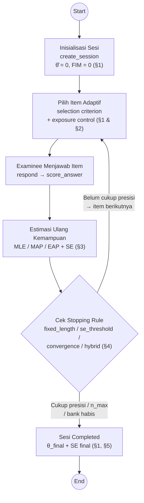
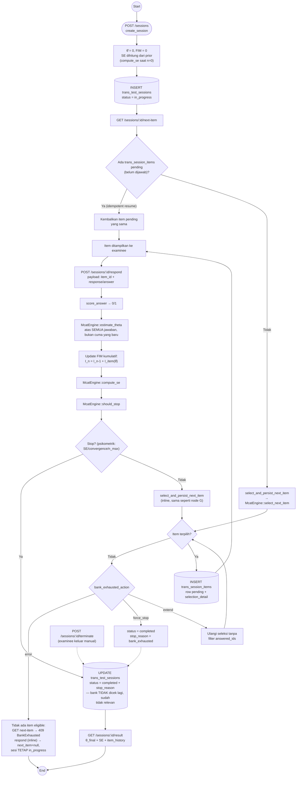
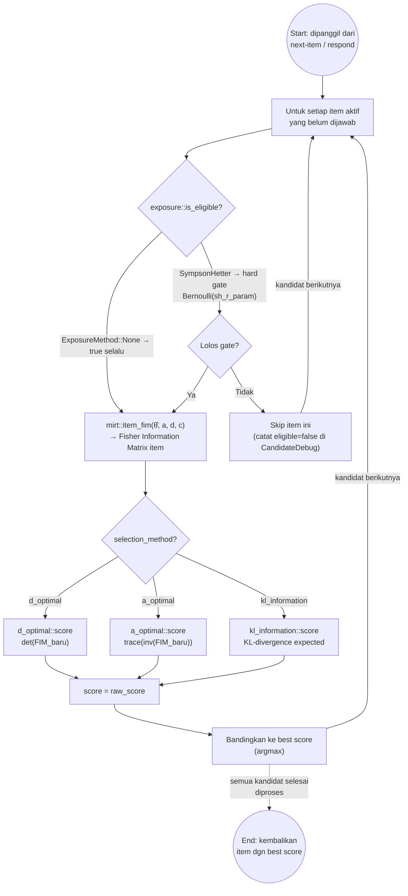
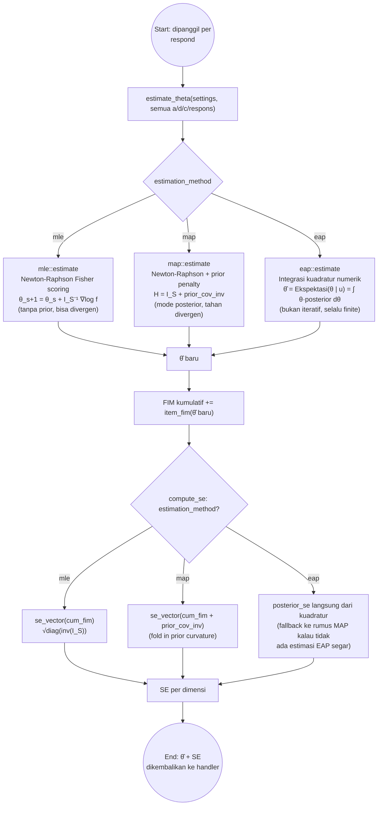
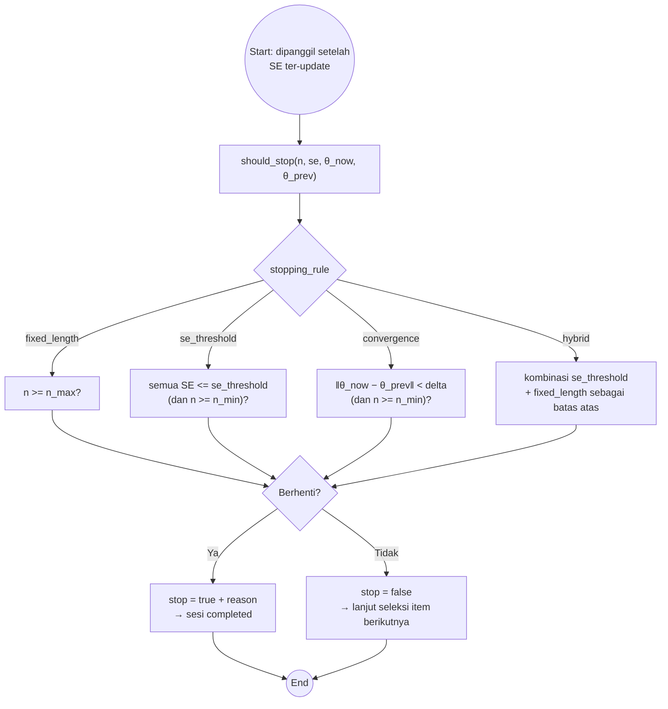
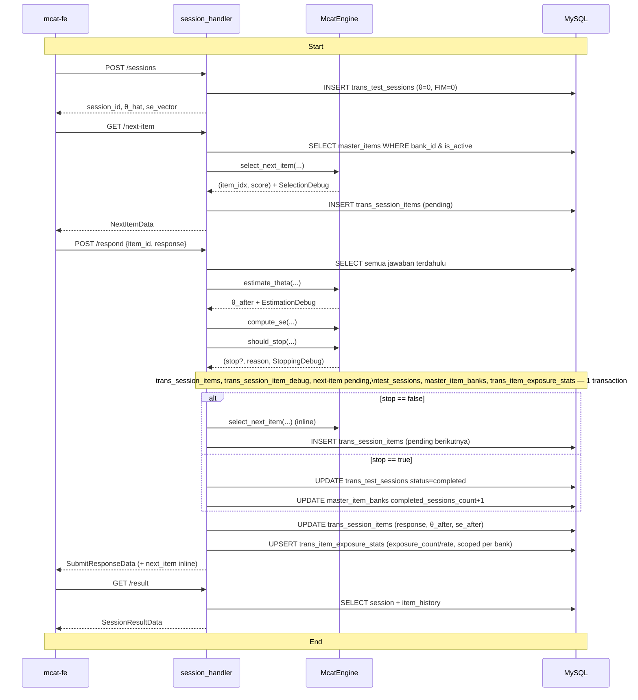

> Dokumen ini adalah peta (bukan teori) — untuk pembuktian rumus per komponen lihat
> catatan di folder sebelah: [`estimation/`](./estimation/estimation_summary.md),
> [`item_selection/`](./item_selection), [`exposure/`](./exposure/exposure.md),
> [`stoping/`](./stoping/stoping.md). Kontrak client-facing resmi ada di
> [`API_CONTEXT.md`](../../API_CONTEXT.md). Kode produksi yang dirujuk di sini hidup di
> [`src/handlers/session_handler.rs`](../handlers/session_handler.rs) dan
> [`src/mcat/engine.rs`](../mcat/engine.rs).

## 0. Gambaran besar (big picture)

Sebelum masuk ke detail per komponen, ini inti dari seluruh algoritma MCAT: satu
**loop adaptif** yang berulang per item — pilih item paling informatif, examinee
menjawab, estimasi ulang kemampuan, cek apakah sudah cukup presisi untuk berhenti —
sampai stopping rule terpenuhi. Tiap kotak di bawah adalah satu "modul" yang dibahas
lebih dalam di section bernomor sama.



**Tiga poin kunci** yang membedakan MCAT dari CAT unidimensional biasa, semuanya
kelihatan di loop ini:

1. **Pilih Item** menilai informasi item secara **multidimensional** (matriks FIM
   k×k, bukan skalar) — lihat §2.
2. **Estimasi** menghasilkan **vektor θ̂** (Verbal, Numeric, Reasoning sekaligus),
   bukan satu skalar kemampuan — lihat §3.
3. **Stopping rule** mengevaluasi presisi di **semua dimensi sekaligus** (SE per
   dimensi harus memenuhi threshold, bukan cuma satu SE global) — lihat §4.

## 1. Siklus hidup satu sesi (level REST)

Satu sesi MCAT adalah loop `next-item → respond` yang berulang sampai stopping rule
terpenuhi atau bank soal habis, dibungkus oleh `create` di awal dan `result` di akhir.
Rute resmi ada di [`routes/sessions.rs`](../routes/sessions.rs):



**Catatan implementasi yang penting dari alur di atas:**

- `respond` selalu **re-estimasi θ̂ dari nol** memakai seluruh riwayat jawaban
  ([`session_handler.rs:340-368`](../handlers/session_handler.rs#L340-L368)), bukan
  update incremental — hanya FIM yang di-update secara aditif
  (`session_handler.rs:373-374`).
- `respond` menyisipkan seleksi item berikutnya **secara inline** di response yang
  sama ([`session_handler.rs:425-444`](../handlers/session_handler.rs#L425-L444)) —
  field `next_item`, supaya FE tidak perlu panggilan terpisah ke `GET next-item`
  di jalur normal. `GET next-item` sendiri tetap ada untuk resume/idempotency.
- `GET next-item` bersifat **idempotent**: kalau ada `trans_session_items` yang sudah
  di-insert tapi belum dijawab (`response IS NULL`), item yang sama dikembalikan
  lagi, bukan diseleksi ulang (`session_handler.rs:243-269`).

## 2. Di dalam `select_next_item` (item selection + exposure control)

Ini bagian yang paling banyak sub-komponennya. Dipanggil dari `next-item` maupun
inline dari `respond`, satu kali per kandidat item yang belum diadministrasikan dan
`is_active` ([`engine.rs:20-122`](../mcat/engine.rs#L20-L122)):



Ringkasan filosofi per method (detail rumus & pembuktian di
[`item_selection/`](./item_selection) dan [`exposure/exposure.md`](./exposure/exposure.md)):

| Sub-komponen | Method | File produksi |
|---|---|---|
| Selection criterion | `d_optimal` / `a_optimal` / `kl_information` | [`selection/*.rs`](../mcat/selection) |
| Exposure control (hard gate) | `sympson_hetter` | [`exposure/sympson_hetter.rs`](../mcat/exposure/sympson_hetter.rs) |
| Exposure control (off) | `none` | tidak ada logika tambahan |

## 3. Di dalam `estimate_theta` + `compute_se` (ability estimation)

Dipanggil sekali per `respond`, atas **seluruh** jawaban yang sudah masuk
([`engine.rs:125-202`](../mcat/engine.rs#L125-L202)):



## 4. Di dalam `should_stop` (stopping rule)

Dipanggil setelah SE ter-update, per `respond`
([`engine.rs:205-246`](../mcat/engine.rs#L205-L246)):



## 5. Ringkasan pemetaan endpoint → engine → DB



## 6. Peta modul kode

```
src/mcat/
├── engine.rs         ← orkestrator: select_next_item, estimate_theta, compute_se, should_stop
├── mirt.rs           ← item_fim, se_vector (matematika IRT multidimensional bersama)
├── debug.rs          ← CandidateDebug/SelectionDebug/EstimationDebug/StoppingDebug (audit trail)
├── playground.rs     ← simulasi tanpa DB, dipakai fitur "Playground" di FE
├── estimation/       ← mle.rs, map.rs, eap.rs   (§3 di atas)
├── selection/        ← d_optimal.rs, a_optimal.rs, kl_information.rs   (§2 di atas)
├── exposure/         ← sympson_hetter.rs, BankExhaustedAction   (§2 di atas)
└── stopping/         ← fixed_length.rs, se_threshold.rs, convergence.rs, hybrid.rs   (§4 di atas)
```

Handler yang memanggil `McatEngine` dan mem-persist hasilnya ke MySQL:
[`src/handlers/session_handler.rs`](../handlers/session_handler.rs) — lihat §1 di atas
untuk alur lengkapnya per endpoint.
